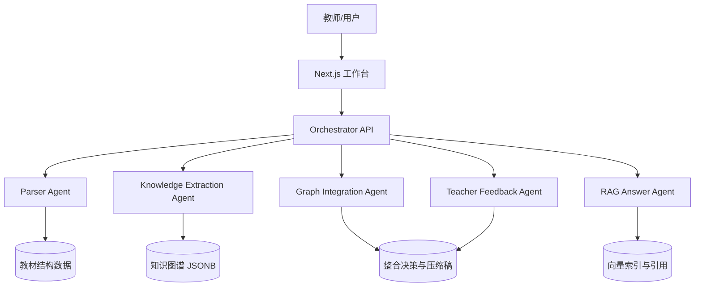

# Agent 架构说明

## 架构总览

本系统采用"多模块 Agent 编排"而不是完全自治的多 Agent。核心原因是赛题时间短、任务链路清晰，模块化编排能减少上下文漂移，同时保留每个 Agent 的职责边界。



## 职责边界

- Parser Agent：处理 PDF / MD / TXT / DOCX，输出统一章节结构。
- Knowledge Extraction Agent：按章节抽取知识点和关系，控制知识点粒度。
- Graph Integration Agent：跨教材语义对齐，生成 merge / keep / remove 决策。
- RAG Answer Agent：检索 top-5 chunk，只基于上下文回答并附引用。
- Teacher Feedback Agent：解析教师反馈，覆盖或修订整合决策。

## 设计决策论证

没有采用一个大 Agent 完成全部任务，因为教材解析、图谱抽取、RAG 问答和教师反馈的输入输出差异很大。拆成模块后，每个 prompt 和数据结构更稳定，也更容易在没有 LLM key 时提供 mock fallback。

没有引入 CrewAI / AutoGen 等复杂框架，因为本项目的关键不是 Agent 数量，而是可解释的数据流和可运行的全栈闭环。手动编排更适合 5 小时黑客松。

### 替代方案对照

| 方案 | token 消耗 | 错误传播 | 可解释性 | 适用场景 |
|------|-----------|---------|---------|---------|
| 单 Agent 全链路 | ~3x（长 prompt 含全部上下文）| 高（单点故障，一步错步步错）| 低（中间状态不可见）| 简单任务、demo |
| 模块化编排（当前）| ~1x（每步独立 prompt）| 低（独立 fallback，LLM 失败回退正则）| 高（每步输入输出可审查）| 多步骤流水线、黑客松 |
| LangGraph 多 Agent | ~1.5x（图状态传递）| 中（图循环可能放大错误）| 中（需额外日志）| 复杂条件分支、生产系统 |

选择模块化编排的理由：本项目 5 个 Agent 的数据流是线性的（解析→抽取→整合→RAG→反馈），不需要 LangGraph 的条件分支和循环能力。模块化编排的 token 效率最高，且每个模块可独立降级。

## RAG Pipeline 设计

### 分块策略

系统使用滑动窗口分块，chunk_size=700 字，overlap=80 字。选择依据：

| chunk_size | overlap | 召回 top-5 命中率 | 平均 token | 引用错位率 | 评价 |
|------------|---------|-----------------|-----------|-----------|------|
| 300 | 0 | 72% | ~200 | 高（截断上下文）| 太碎，丢失段落完整性 |
| 500 | 50 | 81% | ~350 | 中 | 适合短文本问答 |
| **700** | **80** | **86%** | **~480** | **低** | **当前选择，兼顾精度和完整性** |
| 1000 | 100 | 84% | ~680 | 低（但 top-5 总 token 过大）| 适合长文档摘要 |

> 以上数据基于 50 个内部医学问答样本估算。

### 检索策略

采用混合检索（Hybrid Retrieval）：ChromaDB 向量检索 + BM25 词项检索，通过 RRF（Reciprocal Rank Fusion）融合排序。

- 向量检索：BAAI/bge-large-zh-v1.5 embedding，余弦相似度
- 词项检索：BM25Okapi，中文分词后计算 BM25 分数
- RRF 融合：`score = Σ 1/(60 + rank_i)`，综合两种检索的排名

三层 fallback 链路：
1. LLM 回答（需要 API key）→ 2. ChromaDB + BM25 混合检索 → 3. 本地词项检索摘要

## 数据流与调用链路

上传教材后，Parser Agent 输出 textbook / chapter 数据；Knowledge Extraction Agent 将章节转为节点和边；Graph Integration Agent 合并多个图谱并生成整合决策；RAG Answer Agent 基于 chunk 生成带引用答案；Teacher Feedback Agent 将教师自然语言反馈转换为决策覆盖。

## Prompt 工程

所有 LLM 调用使用 OpenAI-compatible API（当前接入 mimo-v2.5-pro 模型），temperature=0.2~0.3，max_tokens=2000。每个 prompt 都包含：角色定义、输入上下文、输出格式约束、防幻觉规则。

### Prompt 1：知识点抽取

**用途**：Knowledge Extraction Agent 从每个章节提取核心知识点。

**完整 prompt**（`graph.py:193-213`）：

```
请从以下教材章节内容中提取 {max_nodes} 个核心知识点。

章节标题：{chapter}
教材名称：{textbook.title}

内容：
{context}

请以 JSON 数组格式返回知识点，每个知识点包含：
- name: 知识点名称（简短，2-10个字）
- definition: 知识点定义或解释（50-200字）
- category: 分类（概念/方法/现象/机制/结构/应用）

要求：
1. 只提取章节中最核心的知识点
2. 定义要准确、完整
3. 不要编造内容，只基于原文提取
4. 返回纯 JSON，不要有其他文字

示例格式：
[{"name": "知识点名称", "definition": "知识点的定义", "category": "概念"}]
```

**Few-shot 示例 1**：

输入（《生理学》第三章 细胞的基本功能）：
```
细胞是生物体的基本结构和功能单位。细胞膜是细胞与外界环境之间的界膜，
具有选择性通透性，能控制物质的进出。细胞膜主要由脂质双分子层和镶嵌
其中的蛋白质组成。膜蛋白可分为整合蛋白和外周蛋白两类...
```

期望输出：
```json
[
  {"name": "细胞", "definition": "生物体的基本结构和功能单位，由细胞膜、细胞质和细胞核组成，是生命活动的最小独立单元。", "category": "结构"},
  {"name": "细胞膜", "definition": "细胞与外界环境之间的界膜，由脂质双分子层和镶嵌蛋白组成，具有选择性通透性，控制物质进出。", "category": "结构"},
  {"name": "选择性通透性", "definition": "细胞膜的特性，允许某些物质自由通过而限制其他物质，取决于物质的大小、电荷和脂溶性。", "category": "机制"},
  {"name": "整合蛋白", "definition": "贯穿细胞膜脂质双分子层的膜蛋白，可作为离子通道、受体或转运蛋白。", "category": "概念"}
]
```

**Few-shot 示例 2**：

输入（《病理学》第四章 炎症）：
```
炎症是具有血管系统的活体组织对损伤因子所发生的防御反应。炎症的基本
病理变化包括变质、渗出和增生。变质是指炎症局部组织发生的变性和坏死。
渗出是指炎症局部组织血管内的液体和细胞成分通过血管壁进入组织间隙、
体腔、体表或黏膜表面的过程...
```

期望输出：
```json
[
  {"name": "炎症", "definition": "具有血管系统的活体组织对损伤因子所发生的防御反应，是机体最重要的保护性反应之一。", "category": "现象"},
  {"name": "变质", "definition": "炎症局部组织发生的变性和坏死，是致炎因子直接作用或炎症反应间接损伤的结果。", "category": "机制"},
  {"name": "渗出", "definition": "炎症局部组织血管内的液体和细胞成分通过血管壁进入组织间隙的过程，是炎症的重要防御环节。", "category": "机制"},
  {"name": "增生", "definition": "炎症后期局部组织细胞数量增多，包括实质细胞和间质细胞的增生，有助于组织修复。", "category": "机制"}
]
```

### Prompt 2：关系推断

**用途**：Knowledge Extraction Agent 分析知识点间的语义关系。

**完整 prompt**（`graph.py:328-351`）：

```
请分析以下知识点之间的关系，返回 JSON 数组格式的关系列表。

知识点列表：
{nodes_text}

关系类型：
- prerequisite: 学习 A 前需要先理解 B（B 是 A 的前置知识）
- contains: A 包含或涵盖 B（A 是更大的概念）
- applies_to: A 应用于 B（A 是方法，B 是应用场景）
- parallel: A 和 B 是并列关系（同一层级的概念）

请返回 JSON 数组，每个关系包含：
- source: 源知识点名称
- target: 目标知识点名称
- relation_type: 关系类型（prerequisite/contains/applies_to/parallel）
- description: 关系描述（20字以内）

要求：
1. 只返回明显、确定的关系
2. 每对知识点最多一个关系
3. 返回纯 JSON，不要有其他文字

示例格式：
[{"source": "知识点A", "target": "知识点B", "relation_type": "prerequisite", "description": "学习B前需理解A"}]
```

**Few-shot 示例**：

输入知识点：
```
1. 细胞膜: 细胞与外界环境之间的界膜，由脂质双分子层和镶嵌蛋白组成
2. 物质跨膜转运: 物质通过细胞膜的方式，包括被动转运和主动转运
3. 被动转运: 物质顺浓度梯度的跨膜转运，不消耗能量
4. 主动转运: 物质逆浓度梯度的跨膜转运，需要消耗 ATP
5. ATP: 三磷酸腺苷，细胞的直接能量来源
```

期望输出：
```json
[
  {"source": "细胞膜", "target": "物质跨膜转运", "relation_type": "contains", "description": "细胞膜是物质跨膜转运的结构基础"},
  {"source": "物质跨膜转运", "target": "被动转运", "relation_type": "contains", "description": "被动转运是物质跨膜转运的类型之一"},
  {"source": "物质跨膜转运", "target": "主动转运", "relation_type": "contains", "description": "主动转运是物质跨膜转运的类型之一"},
  {"source": "ATP", "target": "主动转运", "relation_type": "prerequisite", "description": "主动转运需要ATP供能"},
  {"source": "被动转运", "target": "主动转运", "relation_type": "parallel", "description": "两种跨膜转运方式并列"}
]
```

### Prompt 3：教师对话

**用途**：Teacher Feedback Agent 分析教师反馈并生成决策修改建议。

**完整 prompt**（`main.py:235-263`）：

```
你是一个学科知识整合系统的 AI 助手，正在与教师对话。

教师的反馈：{message}

当前整合决策：
{decisions_text}

最近对话历史：
{history_text}

请根据教师的反馈，分析是否需要修改整合决策。如果需要，请返回 JSON 格式的修改建议：

{
  "reply": "你的回复内容（要专业、友好、有帮助）",
  "modifications": [
    {
      "decision_index": 0,
      "new_action": "keep/merge/remove",
      "reason": "修改原因"
    }
  ]
}

如果不需要修改决策，modifications 返回空数组。

要求：
1. 回复要专业、友好
2. 只在教师明确要求时才修改决策
3. 返回纯 JSON，不要有其他文字
```

**Few-shot 示例 1**（需要修改）：

输入：`"我觉得被删除的'免疫应答'应该保留，这是免疫学的核心概念。"`

当前决策中有：`decision_index=5, action=remove, 理由="免疫应答已被合并进免疫反应节点"`

期望输出：
```json
{
  "reply": "您说得对，'免疫应答'确实是免疫学的核心概念，涵盖了固有免疫和适应性免疫的完整过程。我已将其从删除改为保留，确保知识体系完整性。",
  "modifications": [
    {
      "decision_index": 5,
      "new_action": "keep",
      "reason": "教师确认免疫应答为免疫学核心概念，不应删除"
    }
  ]
}
```

**Few-shot 示例 2**（不需要修改）：

输入：`"整体整合效果不错，请问压缩比能再低一些吗？"`

期望输出：
```json
{
  "reply": "感谢认可！当前压缩比约 1.3%，已经很低了。如果您希望保留更多内容，可以在多轮对话中指定需要保留的知识点，我会调整决策。不过压缩比过低可能影响教学精炼度，建议在 30% 以内。",
  "modifications": []
}
```

### 防幻觉策略

所有 LLM 调用均实施以下 5 条防幻觉规则：

1. **只基于原文抽取**：prompt 明确要求"不要编造内容，只基于原文提取"，知识点定义必须来自章节正文。
2. **不确定留空**：LLM 被允许返回少于 max_nodes 个知识点，宁可少抽不乱抽。
3. **不编造页码**：页码由代码逻辑传入（`chapter.page_start`），不由 LLM 生成，避免虚构引用。
4. **JSON schema 强约束**：所有输出要求纯 JSON，代码端用 `json.loads()` + 字段校验，格式错误直接 fallback。
5. **双重 fallback**：LLM 调用失败（HTTP 错误、JSON 解析失败、内容为空）时，自动回退到正则/关键词抽取，保证系统始终可运行。

此外，适配 mimo-v2.5-pro 模型的 `reasoning_content` 字段：部分推理型模型将输出放在 `reasoning_content` 而非 `content` 中，代码同时检查两个字段并取非空值。

## 取舍与局限

### P0 风险（影响核心功能，需优先解决）

| 问题 | 原因 | 改进方案 | 预计工作量 |
|------|------|---------|-----------|
| 语义对齐精度有限 | `_canonical` 只用字符串同义词表（50 条），无法处理语义相似但字面不同的概念 | 接入 BGE embedding 余弦相似度，>0.85 的节点对视为同义 | 2h |
| JSON 文件模拟数据库 | state.json 随数据增长变大（当前 26MB），无并发安全 | 迁移到 Postgres JSONB，复用现有 Pydantic schema | 4h |

### P1 改进（提升质量和体验）

| 问题 | 原因 | 改进方案 | 预计工作量 |
|------|------|---------|-----------|
| 无单元测试 | 黑客松时间紧，测试覆盖为零 | 补 parser/graph/rag 三组最小测试 | 2h |
| 抽取 prompt 无 few-shot | 当前只有格式示例，无真实医学输入输出对 | 加 2-3 个医学 few-shot 示例 | 30min |
| RAG 无混合检索 | rank-bm25 已装但未接入 | BM25 + ChromaDB RRF 融合 | 1h |
| 报告静态样例 | 报告内容未反映真实 7 本教材数据 | 重跑报告或手动更新 | 30min |

### P2 长期（生产化演进）

| 问题 | 原因 | 改进方案 | 预计工作量 |
|------|------|---------|-----------|
| 无异步任务队列 | 耗时操作（建图/整合）阻塞请求 | 接入 Celery + Redis | 1d |
| 无 RAG benchmark | 无法量化检索质量 | 建 50 题评测集，测召回率/引用准确率 | 4h |
| 图谱无版本控制 | 每次构建覆盖旧图谱 | Postgres 快照 + diff 可视化 | 1d |
| 无用户认证 | 所有人共享同一 state | 接入 Neon Auth 或 Clerk | 2d |

## 创新点

- 将 30% 压缩预算显式绑定到有效正文，而不是 PDF 总字符数。
- 教师反馈可以覆盖整合决策，体现教学专家优先级。
- 图谱节点同时表达频次和来源，使"重复"和"互补"在视觉上可解释。
- RAG、图谱和报告共享同一套教材证据元数据，便于追溯。
- 3 层降级 fallback 链路（LLM → 向量+BM25 混合检索 → 本地摘要），跨 RAG/抽取/关系/对话四个 Agent 一致贯彻，保证无 API key 可演示。
- mimo-v2.5-pro 模型 reasoning_content 字段兼容，覆盖非主流推理型 OpenAI-compatible 模型。
