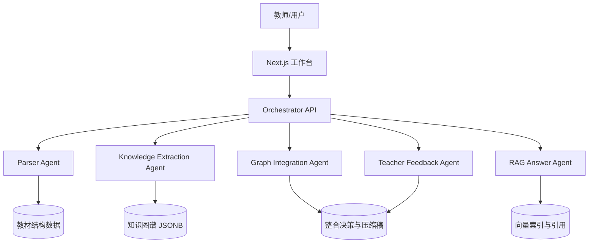

# Agent 架构说明

## 架构总览

本系统采用“多模块 Agent 编排”而不是完全自治的多 Agent。核心原因是赛题时间短、任务链路清晰，模块化编排能减少上下文漂移，同时保留每个 Agent 的职责边界。

## 职责边界

- Parser Agent：处理 PDF / MD / TXT / DOCX，输出统一章节结构。
- Knowledge Extraction Agent：按章节抽取知识点和关系，控制知识点粒度。
- Graph Integration Agent：跨教材语义对齐，生成 merge / keep / remove 决策。
- RAG Answer Agent：检索 top-5 chunk，只基于上下文回答并附引用。
- Teacher Feedback Agent：解析教师反馈，覆盖或修订整合决策。

## 设计决策论证

没有采用一个大 Agent 完成全部任务，因为教材解析、图谱抽取、RAG 问答和教师反馈的输入输出差异很大。拆成模块后，每个 prompt 和数据结构更稳定，也更容易在没有 LLM key 时提供 mock fallback。

没有引入 CrewAI / AutoGen 等复杂框架，因为本项目的关键不是 Agent 数量，而是可解释的数据流和可运行的全栈闭环。手动编排更适合 5 小时黑客松。

## 数据流与调用链路

上传教材后，Parser Agent 输出 textbook / chapter 数据；Knowledge Extraction Agent 将章节转为节点和边；Graph Integration Agent 合并多个图谱并生成整合决策；RAG Answer Agent 基于 chunk 生成带引用答案；Teacher Feedback Agent 将教师自然语言反馈转换为决策覆盖。

## Prompt 工程

正式接入 LLM 时，每个章节单独处理，要求 JSON 输出，并提供 few-shot 示例。Prompt 必须包含防幻觉约束：只基于章节原文抽取，不确定时留空，不编造页码。

## 取舍与局限

当前版本用启发式抽取和 JSON 文件模拟数据库，保证无 API key 可演示。局限是语义对齐精度不如真实 embedding + LLM 判定。后续可加入 Chroma 持久索引、Postgres JSONB、RAG benchmark、异步任务队列和更严格的人工标注评测。

## 创新点

- 将 30% 压缩预算显式绑定到有效正文，而不是 PDF 总字符数。
- 教师反馈可以覆盖整合决策，体现教学专家优先级。
- 图谱节点同时表达频次和来源，使“重复”和“互补”在视觉上可解释。
- RAG、图谱和报告共享同一套教材证据元数据，便于追溯。

