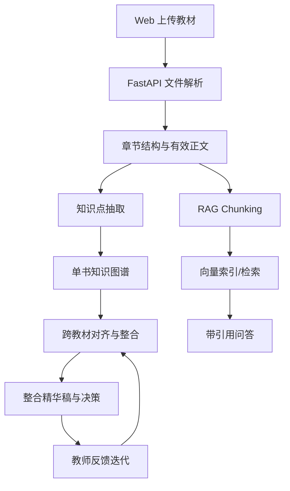

# 系统设计

## 架构总览

## 技术选型

- Next.js + TypeScript：适合快速构建单页工作台，并具备良好的类型约束。
- Cytoscape.js：满足节点点击、缩放、拖拽、频次可视化和来源颜色映射。
- FastAPI：方便复用 Python 教材解析、embedding、reranker 与 RAG 生态。
- Postgres JSONB 目标数据层：适合保存知识图谱、决策和版本 diff。当前实现用 JSON 文件模拟仓储接口，便于黑客松本地演示。
- ChromaDB：用于向量索引，当前服务保留接口和依赖，默认启发式 fallback 可无 key 演示。

## 数据流

1. 用户上传教材文件。
2. 后端保存文件并生成教材记录。
3. 解析服务按格式抽取章节、页码和有效正文。
4. 图谱服务按章节抽取知识点并推断关系。
5. 整合服务跨书对齐节点，生成 merge / keep / remove 决策。
6. RAG 服务按 500–800 字切块并检索 top-5 证据。
7. 教师对话服务根据反馈覆盖整合决策。
8. 报告服务将运行结果写入 `report/整合报告.md`。

## API 一览

- `POST /api/textbooks/upload`
- `POST /api/textbooks/parse`
- `POST /api/graph/build`
- `POST /api/graph/merge`
- `POST /api/rag/index`
- `POST /api/rag/query`
- `GET /api/rag/status`
- `POST /api/teacher/chat`
- `POST /api/report/generate`

